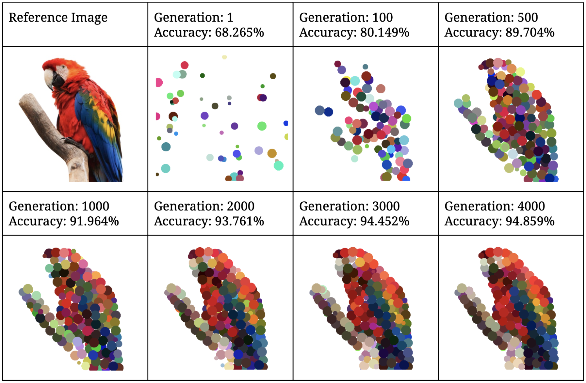
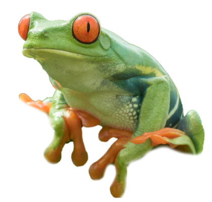
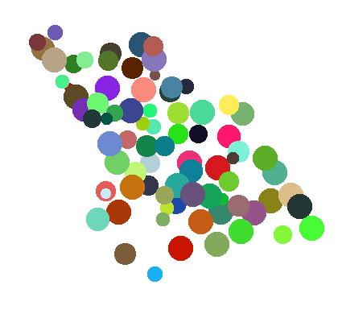
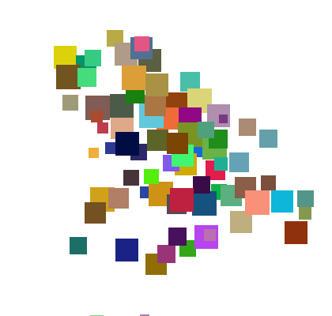
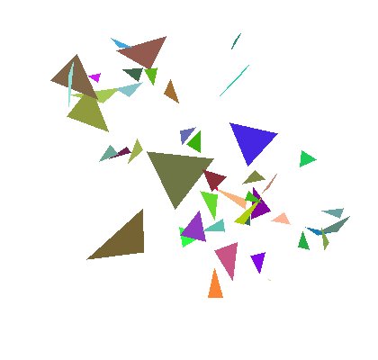
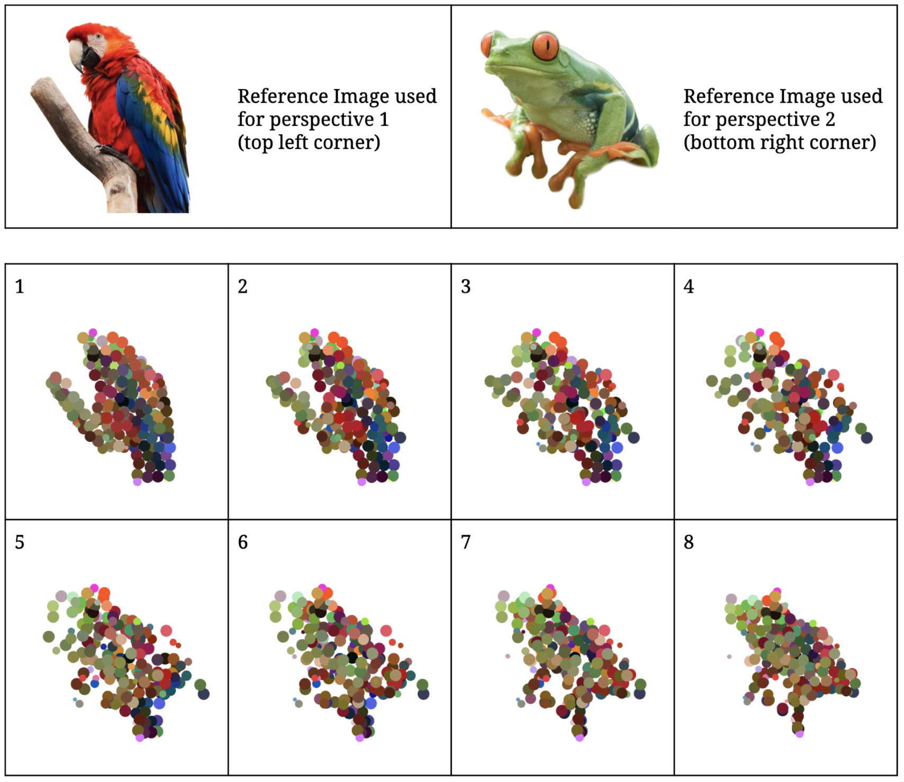
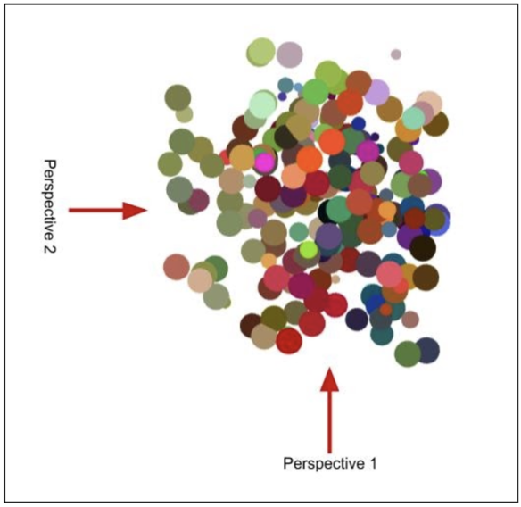
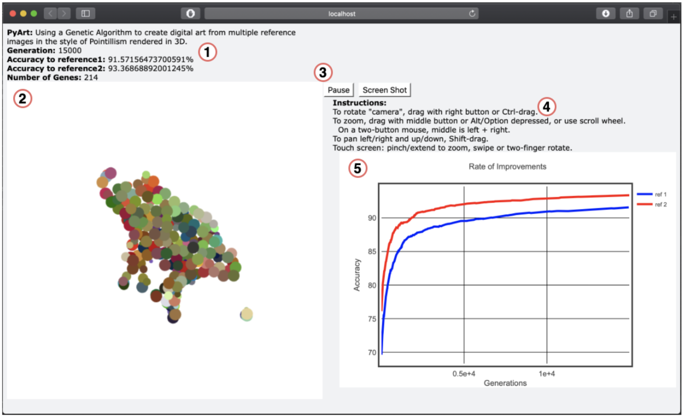

# 2-Dimensional and 3-Dimensional Evolutionary Art Using Genetic Algorithms
## Computer Science BSc Dissertation

This project is about producing 2-dimensional and 3-dimensional art through the use of Evolutionary Algorithms. The 2-dimensional art is generated using a given reference image, which is then reproduced in an artistic style. This project also explores a method to generate 3-dimensional digital anamorphic sculptures that are rendered in a 3D environment which can produce artistic images from multiple reference images simultaneously where each image can be seen depending on the perspective at which you view the digital anamorphic sculpture. This technique involves using the Python Image Library (PIL) to describe the digital sculpture as two 2-dimensional images viewed from specific perspectives and rendering the sculpture in 3 dimensions using the python library Vpython.

To read a detailed explanation of this project the final report can be found in the report directory. 

## Project Requirements:

### Python Version Required:
- Python 3.8.1 (or higher)

### Libraries Required:
- PIL (Python Image Library)
- Vpython
- numpy
- multiprocessing
- random
- os
- datetime
- copy

Use pip3 to install the required libraries.

## 2 Dimensional Art Examples

### Evolution Process

### Gene Types
2 dimensional art can have different gene types.

Reference Image:

<table>
  <tr>
      <td><b>Circle</b></td>
      <td><b>Square</b></td>
      <td><b>Triangle</b></td>
  </tr>
  <tr>
      <td></td>
      <td></td>
      <td></td>
  </tr> 
</table>

## Visualizing 3 Dimensional Art
Starting from perspective 1 (top left corner) the Organism is slightly rotated to the right until the camera is in the position to view the Organism from perspective 2 (bottom right corner). 

The image below offers a “top-down” view of the Organism to help demonstrate the perspectives relative to the Organism.

## 3 Dimensional Art GUI

1. The Live Display Counters: Provided the user with relevant realtime information about the digital art being displayed such as the: current generation, accuracy to each of the reference images and the total number of Genes.
2. The 3D Scene: Used to render the Organisms and display the digital art. It allows the user to control the camera in order to change the perspective.
3. Buttons: The “Pause” button allows the user to pause and run the execution of the algorithm on a specific generation to allow them to view the digital art uninterrupted. The “Screen Shot” button allows the user to take a picture of the digital art and save it directly to their downloads folder.
4. Instructions: The instructions provide a guide on how to control the camera for the 3D scene.
5. The Graph: Displays the real time rate of improvement of the digital art being generated. Providing the user with additional information that may be helpful with understanding how the genetic algorithm is able to approximate the given reference images.
